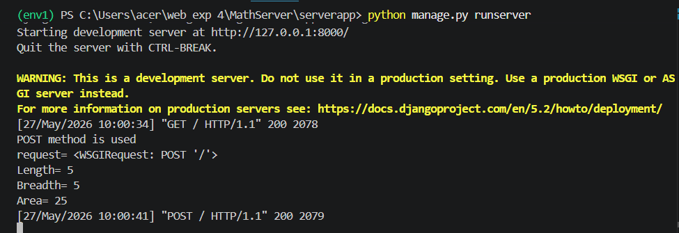
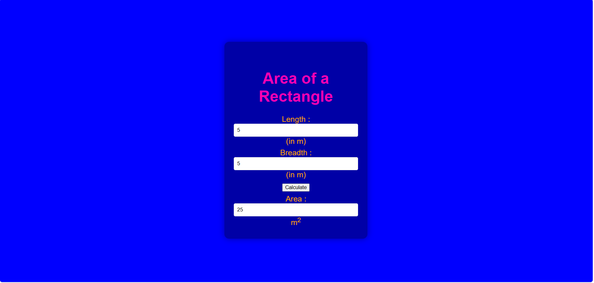

# Ex.04 Design a Website for Server Side Processing
## Date:

## AIM:
To create a web page to calculate total bill amount with GST from price and GST percentage using server-side scripts.

## FORMULA:
Bill = P + (P * GST / 100)
<br> P --> Price (in Rupees)
<br> GST --> GST (in Percentage)
<br> Bill --> Total Bill Amount (in Rupees)

## DESIGN STEPS:

### Step 1:
Clone the repository from GitHub.

### Step 2:
Create Django Admin project.

### Step 3:
Create a New App under the Django Admin project.

### Step 4:
Create a HTML file to implement form based input and output.

### Step 5:
Create python programs for views and urls to perform server side processing.

### Step 6:
Receive input values from the form using request.POST.get().

### Step 7:
Calculate the total bill amount (including GST).

### Step 8:
Display the calculated result in the server console.

### Step 9:
Render the result to the HTML template.

### Step 10:
Publish the website in Localhost.

## PROGRAM:
math.html
```
<!DOCTYPE html>
<html>
<head>
    <title>Area Calculator</title>
    <style>
        body {
            font-size: 20px;
            background-color: blue;
            color: white;
            margin: 0;
            padding: 0;
            font-family: Arial, sans-serif;
        }
        .edge {
            display: flex;
            justify-content: center;
            align-items: center;
            min-height: 100vh;
        }
        .box {
            background-color: rgba(0, 0, 0, 0.35);
            padding: 24px;
            border-radius: 12px;
            width: 320px;
            box-shadow: 0 0 16px rgba(0, 0, 0, 0.35);
        }
        .formelt {
            color: orange;
            text-align: center;
            margin-top: 7px;
            margin-bottom: 6px;
        }
        h1 {
            color: rgb(255, 0, 179);
            text-align: center;
            padding-top: 20px;
            margin-bottom: 24px;
        }
        input[type="text"] {
            width: 100%;
            padding: 8px;
            border: 1px solid #ddd;
            border-radius: 4px;
            box-sizing: border-box;
        }
    </style>
</head>
<body>
    <div class="edge">
        <div class="box">
            <h1>Area of a Rectangle</h1>
            <form method="POST">
                
                <div class="formelt">
                    Length : <input type="text" name="length" value="{{l}}">(in m)<br/>
                </div>
                <div class="formelt">
                    Breadth : <input type="text" name="breadth" value="{{b}}">(in m)<br/>
                </div>
                <div class="formelt">
                    <input type="submit" value="Calculate"><br/>
                </div>
                <div class="formelt">
                    Area : <input type="text" name="area" value="{{area}}" readonly>m<sup>2</sup><br/>
                </div>
            </form>
        </div>
    </div>
</body>
</html>
```
view.py
```
from django.shortcuts import render

def rectarea(request):
    context = {}
    context['area'] = "0"
    context['l'] = "0"
    context['b'] = "0"
    if request.method == 'POST':
        print("POST method is used")
        l = request.POST.get('length','0')
        b = request.POST.get('breadth','0')
        print('request=', request)
        print('Length=', l)
        print('Breadth=', b)
        area = int(l) * int(b)
        context['area'] = area
        context['l'] = l
        context['b'] = b
        print('Area=', area)
    return render(request, 'mathapp/math.html', context)
```
urls.py
```
from django.contrib import admin
from django.urls import path
from mathapp import views

urlpatterns = [
    path('admin/', admin.site.urls),
    path('areaofrectangle/', views.rectarea, name="areaofrectangle"),
    path('', views.rectarea, name="areaofrectangleroot")
]
```


## OUTPUT - SERVER SIDE:



## OUTPUT - WEBPAGE:



## RESULT:
The a web page to calculate total bill amount with GST from price and GST percentage using server-side scripts is created successfully.
